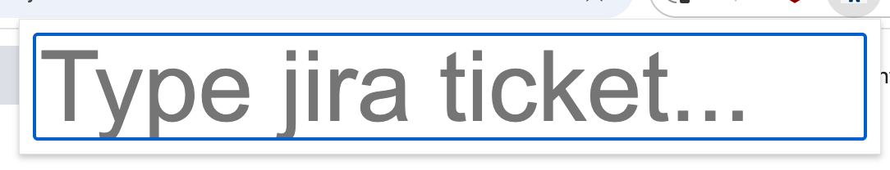
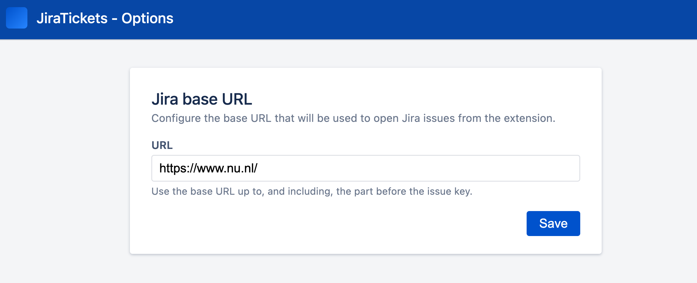

## JiraTickets Chrome Extension

JiraTickets is a small Chrome extension that lets you quickly open Jira issues by typing the ticket key. Instead of manually navigating to Jira and searching for an issue, you can press a hotkey, type the ticket ID (for example `ABC-123`), and a new tab will open directly on that issue page.

### Screenshots

**Ticket search popup**

**Settings (options) page**

### How it works

- The extension stores your Jira base URL (for example `https://jira.yourcompany.com/browse/`) in Chrome sync storage.
- When you open the popup, you can type a Jira ticket key into the input field.
- When you press **Enter**, the extension concatenates the stored base URL with the ticket key and opens the resulting URL in a new browser tab.

### Installing the extension (development mode)

1. Clone or download this repository.
2. Open Chrome and go to `chrome://extensions/`.
3. Enable **Developer mode** (top-right toggle).
4. Click **Load unpacked** and select the folder containing this project.

### Configuring the Jira base URL (Options page)

The extension needs to know your Jira base URL in order to build full issue links.

To configure it:

1. Open Chrome and go to `chrome://extensions/`.
2. Find **JiraTickets** in the list.
3. Click **Details**.
4. Click **Extension options**.
5. In the **URL** field, enter your Jira base URL.  
   - Example: `https://jira.yourcompany.com/browse/`
   - Make sure this is the part of the URL that appears before the ticket key.
6. Click **Save**.  
   You should see a short “Options saved.” message confirming that your settings were stored.

The URL is saved using `chrome.storage.sync`, so it will sync across Chrome profiles where sync is enabled.

### Using the popup

Once the base URL is configured:

1. Click the **JiraTickets** extension icon in the Chrome toolbar to open the popup.
2. The text field will automatically get focus.
3. Type the Jira ticket key you want to open (for example `COVID-19`).
4. Press **Enter**.

A new tab will open with the full URL:  
`<configured base URL><ticket key>`

### Keyboard shortcut (hotkey)

You can open the JiraTickets popup directly with a keyboard shortcut:

- **Windows / Linux**: `Ctrl + J`  
- **macOS**: `Command + J`

When you press this hotkey:

1. The JiraTickets popup opens.
2. The input field is automatically focused.
3. You can immediately type your Jira ticket key and press **Enter** to open it in a new tab.

If the default shortcut conflicts with another shortcut or does not work as expected, you can change it in Chrome:

1. Go to `chrome://extensions/shortcuts`.
2. Find **JiraTickets**.
3. Set a new key combination for **“Open Jira ticket popup”**.

